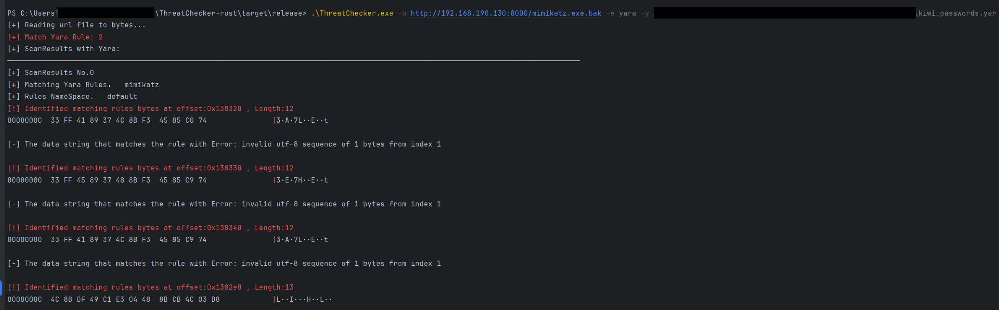

# ThreatChecker-Rust

ThreatChecker-Rust is a malware analysis tool rewritten in Rust, can be used to detect whether a file is malicious by AMSI or Defender or Yara-X and display relevant detection results, including identifying the specific bad pieces of code, Currently, binary files and script files are supported. This version:

- Identified the bytes by [Yara-X](https://virustotal.github.io/yara-x/) (https://github.com/VirusTotal/yara-x).
    - Two yara rules are built in (you can change them in the source code to suit your needs)
    - You can specify the custom yara rule file through `yarafile`flag
- Identifies the bytes that Microsoft Defender / AMSI Consumer flags on.
- Detect URL files, as well as files on disk.
- Support binary files and some scripts
- Displays key result information by color.

Compared to the Golang version, the Rust version is very user-friendly and doesn't have to spend time with the yara-x environment configuration and yara-x Go library. Users can simply compile the rust source code to get the program and use it. Golang calling yara-x requires some effort to compile yara-x header files and yara-x library files. Users can choose different versions according to their interests.

- **ThreatChecker Rust Version(Recommended)**: https://github.com/zz1gg/ThreatChecker-rust
- ThreatChecker Golang Version: https://github.com/zz1gg/threatchecker


> [Yara-X](https://virustotal.github.io/yara-x/): YARA-X is a re-incarnation of YARA, with a focus on user-friendliness, performance and safety

> [Anti-malware Scan Interface (AMSI) integration with Microsoft Defender Antivirus](https://learn.microsoft.com/en-us/defender-endpoint/amsi-on-mdav): AMSI provides a deeper level of inspection for malicious software that employs obfuscation and evasion techniques on Windows' built-in scripting hosts. By integrating AMSI, Microsoft Defender for Endpoint offers extra layers of protection against advanced threats.
> AMSI Supported Scripting Languages: PowerShell, Jscript, VBScript, Windows Script Host (wscript.exe and cscript.exe), NET Framework 4.8 or newer (scanning of all assemblies), Windows Management Instrumentation (WMI)

> [YARA-X Rust](https://virustotal.github.io/yara-x/docs/api/rust/): YARA-X is written in Rust, so, integrating it into your own Rust project is extremely easy. You can start by visiting the yara-x crate page, or go straight to the documentation.


## Usage


1. build it with `cargo build --release`:
2. go to `ThreatChecker-rust\target\release` directory, run it:
```bash
.\ThreatChecker.exe -u http://192.168.190.130:8000/launcher.ps1 -e defender 
.\ThreatChecker.exe -f C:\Users\xxx\launcher.ps1 -e defender
.\ThreatChecker.exe -u http://192.168.190.130:8000/launcher.ps1 
.\ThreatChecker.exe -u http://192.168.190.130:8000/mimikatz.exe.bak -e yara -y C:\Users\xxx\kiwi_passwords.yar
.\ThreatChecker.exe -u http://192.168.190.130:8000/mimikatz.exe.bak -e yara
.\ThreatChecker.exe -f C:\Users\xxx\mimikatz.exe.bak -e yara
.\ThreatChecker.exe -u http://192.168.190.130:8000/mimikatz.exe.bak -e amsi
.\ThreatChecker.exe -u http://192.168.190.130:8000/mimikatz.exe.bak
.\ThreatChecker.exe -f C:\Users\xxx\mimikatz.exe.bak 
.\ThreatChecker.exe -f C:\Users\xxx\mimikatz.exe.bak -e amsi
```

helptext:

```bash
ThreatChecker-rust version: threatchecker/0.0.1
████████ ██   ██ ██████  ███████  █████  ████████  ██████ ██   ██ ███████  ██████ ██   ██ ███████ ██████
   ██    ██   ██ ██   ██ ██      ██   ██    ██    ██      ██   ██ ██      ██      ██  ██  ██      ██   ██
   ██    ███████ ██████  █████   ███████    ██    ██      ███████ █████   ██      █████   █████   ██████
   ██    ██   ██ ██   ██ ██      ██   ██    ██    ██      ██   ██ ██      ██      ██  ██  ██      ██   ██
   ██    ██   ██ ██   ██ ███████ ██   ██    ██     ██████ ██   ██ ███████  ██████ ██   ██ ███████ ██   ██--rust
   Analyze malicious files and identify bad bytes


Usage: ThreatChecker [OPTIONS]

Options:
  -e, --engine <ENGINE>          Scanning engine. Options: defender or amsi or yara [default: amsi]
  -f, --targetfile <TARGETFILE>  Filepath, analyze a file on disk
  -t, --filetype <FILETYPE>      File type to scan. Options: Bin or Script
  -u, --url <URL>                FileURL, analyze a file from a URL
  -y, --yarafile <YARAFILE>      YaraFile, Specify the Yara file for analysis
  -h, --help                     Print help
  -V, --version                  Print version

```

example:





## HISTORY


Version 0.0.1:
```bash
This version:

   - Identifies the bytes that Microsoft Defender / AMSI Consumer flags on.
   - Detect URL files, as well as files on disk.
   - support yara-x 
   - Support binary files and some scripts 
   - Displays key result information by color.
```


## Note


Note: This tool can only be used for security research and malware analysis teaching. It is strictly forbidden to use this tool for malicious activities and unethical behavior, otherwise the consequences will be borne by the users themselves, and have nothing to do with the developers.


## FAQ

Q1: `Error initializing AMSI: The system cannot find the file specified.`
A1: Please ensure real-time protection is enabled.

Q2:`Failed to scan buffer: The operation completed successfully.`  
A2: Please ensure Windows Security Center is enabled.


## Acknowledgements / References

This project is inspired by the following projects:
- https://github.com/Hubbl3/ThreatCheck
- https://github.com/rasta-mouse/ThreatCheck
- https://github.com/matterpreter/DefenderCheck
- https://virustotal.github.io/yara-x/
- https://pkg.go.dev/github.com/VirusTotal/yara-x/go
